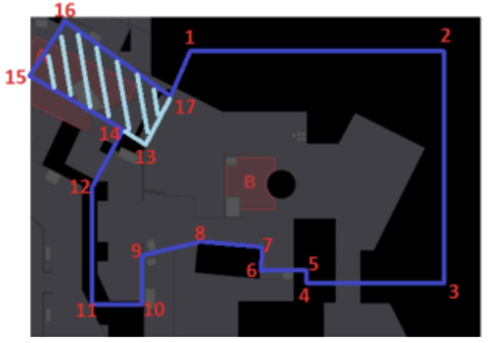

Analyzing Game Data of CS:GO

# Repository Structure

* **README** - Contains the problem statement, questions asked, assumptions considered, answers to the questions and interpretations.

* **box.png** - scaled map image given

* **coordinates.png** - map with coordinates of boundary points figured out

* **game_state_frame_data.parquet** - file containing player data during a CounterStrike match.

* **counter_strike.py** - python file containing _ProcessGameState_ class along with modularized code for answering the questions asked.

* **Counter_Strike.ipynb** - python notebook contatining block wise implementation to display of results seperately. 

* **transformed_game_state_frame_data.parquet** - file containing transformed player data during a CounterStrike match.

* **images** - folder containing all the resulting plots images obtained from the code.

# Problem Statement

## Task
Your CounterStrike coaching staff is analyzing their opponent’s strategies on BombsiteB. They have identified a chokepoint of interest (which has been highlighted in light blue), and there are a few player location questions that they need to address regarding it.

The coordinate details are as follows:
* Z-Axis Bounds: 285 <= Z <= 421
* 13: [-1735, 250]
* 14: [-2024, 398]
* 15: [-2806, 742]
* 16: [-2472, 1233]
* 17: [-1565, 580]

You, being the forward-thinking engineer that you are, know that this type of request will be asked multiple times for different sets of coordinates and games. Let’s engineer a flexible solution for our team to use.

---
1. Write a python class called ProcessGameState that will accomplish the following:
<ol type="a">
  <li>Handle file ingestion and ETL (if deemed necessary)</li>
    <ul>
     <li>When the user instantiate <i>ProcessGameState</i> class, that is make an instance of the class, the path of input file is initialized. 
     <li> <i>extract()</i>: is used to extract data from the parquet file using pyarrow.
     <li> <i>explore()</i>: is used to gain a better of the data; what column it has, number of null values, number of duplicate rows, number of rounds played, names of areas on the map, names of palyers, players of specific team and so on.
     <li> <i>load()</i>: is used to saved the transformed data at the end.
    </ul>
    

    <h3>
    Total Number of rounds played: 
     [ 1  2  3  4  5  6  7  8  9 10 11 12 13 14 16 17 18 19 20 21 22 23 24 25 26 27 28 29 30] 
    Area names on the given map:  ['TSpawn' 'TStairs' 'Tunnels' 'Fountain' 'LowerPark' 'Playground' 'Alley' 'Connector' 'BombsiteA' 'Canal' 'Pipe' 'Water' 'Construction' 'UpperPark' 'Restroom' 'Lobby' 'StorageRoom' 'SnipersNest' 'BackofA' 'Stairs' 'UnderA' 'Walkway' 'Bridge' 'BombsiteB' None 'SideAlley'] 
    Names of players playing the game:  ['Player0' 'Player1' 'Player2' 'Player5' 'Player7' 'Player3' 'Player6' 'Player4' 'Player8' 'Player9'] 
    Players playing for team2:  ['Player5' 'Player7' 'Player6' 'Player8' 'Player9']
    </h3>
     </img>
    (Map based on the mean coordinates grouped by area names just to get a brief understanding in relation to actual map)
    

  <li>Return whether or not each row falls within a provided boundary
  
i)  Be as efficient as possible (minimize runtime)

ii)  Reduce dependencies outside of standard Python libraries unless you can prove significant improvements.</li>
    <ul>
    <li> used numpy array to perform operations efficiently.
    <li> made a numpy array of the boundary points(which would be given- here I have assumed the vertices of the light blue boundary).
    <li> made a path using the boundary points.
    <li> combined the 'x' and 'y' column and made a 'coordinates' column.
    <li> checked for every row if the 'coordinates' are contained inside the path.
    <li> further checked the z-axis contraint for the row to be within the boundary.
    

    <h3>Count of points within x,y axes boundary of vertices 13,14,15,16,17:  17093 
    Count of points within the boundary after considering the Z axis:  832 
    Status of whether or not each row falls within the provided boundary is stored in "within_boundary" column.</h3>
    </ul>
     </img>
     </img>
    

  <li>Extract the weapon classes from the inventory json column</li>
    <ul>
        <li> from the 'inventory' column got the 'weapon_class' key.
        <li> extracted all the weapon_classses for each row and stored them in 'weapons' column.
    </ul>

    <h3>Extracted the weapon classes from the inventory and stored in "weapons" column.</h3>
     </img>
</ol>

---

2. Using the created class, answer the following questions:

<ol type="a">
  <li>Is entering via the light blue boundary a common strategy used by Team2 on T (terrorist) side?</li>

**Approach:**

*   Figure out 'T' from Team2 who are alive and their location(coordinates) is currently inside the light blue boundary.
*   For every round keep track of players moving from light blue boundary to the bigger dark blue boundary towards the BombsiteB.
*   Also keep track of players entering the bigger dark blue boundary towards the BombsiteB from other parts (not via light blue boundary) so that we can compare the results.
*   Compare the count of the usage of light blue boundary to enter and other areas to enter.
*  To understand the it better, plotted paths of all the players on team2 terrorist side.

Note- 'entering' over here refers to entering to the polygon formed by 1,2,3,4,5,6,7,8,9,10,11,12,14,13,17 points; that is the dark blue boundary without the light blue part.

<h3>
Number of Team 2 T side inside the light blue boundary: 19 
Number of times a player from team2 T side enters the dark blue boundary via light blue boundary area: 0 
Number of times a player from team2 T side enters the dark blue boundary via any other area except the light blue boundary area:  36
</h3>

 </img>
Example where the player does not even come near the boundaries.
 </img>
Example where player entered the dark blue region from other area(not light blue boundary).
 </img>
Example where player entered the light blue boundary from the dark blue boundary.

<h3>

-  No, it is not a common strategy used by Team2 on T (terrorist) side. We can see that they never use the light blue area to enter the dark blue area. 
- Although there are a decent number of points inside the light blue boundary, the players do not really use the light blue boundary to enter the bigger dark blue boundary towards the BombsiteB.
- They do use other entrances much more often to enter the dark blue boundary of BombsiteB. This also does makes sense game wise as the Terrorists spawn closer to the Bombsite B giving them almost direct access to it, whereas to towards Bombsite A and then enter would mean facing the CTs near Bombsite A.
- Even if we were to consider the 'entering' definition to be from the light blue area towards BombsiteA, even then the occurances of such paths taken by the player are extremely low.
</h3>

  <li>What is the average timer that Team2 on T (terrorist) side enters “BombsiteB” with least 2 rifles or SMGs?</li>

**Approach:**

*   Figure out 'T' from Team2 who are alive whose location(coordinates) is currently outide BombsiteB.
*   For every round keep track of players moving in and out of BombsiteB so that we can keep track of ammo of players inside BombsiteB and check if team 2 T side has least 2 rifle or SMGs while entering.
*  When any player on team 2 T side enters BombsiteB with ammo more than the given condition note the clock timer.
*   Get averages for every round, then get a combined average.

Note: - the condition for 2 rifles or SMGs is checked for all the players who are 'entering' and who are already 'inside' BombsiteB.

<h3>
Average clock timer in seconds across different rounds: [97.0, 72.0, 77.5] 
Overall average timer in minutes that Team2 on T (terrorist) side enters “BombsiteB” with least 2 rifles or SMGs: 1.37
</h3>

So there were 3 rounds where the players of team 2 playing as T were able to enter the BombsiteB with least 2 rifles or SMGs and the average timer for those rounds were: <b> 97s, 72s, 77.5s</b> 
Overall average timer of team 2 players playing as T to enter the BombsiteB with least 2 rifles or SMGs is <b>1.37 mins</b>

  <li>Now that we’ve gathered data on Team2 T side, let's examine their CT (counter-terrorist) Side. Using the same data set, tell our coaching staff where you suspect them to be waiting inside “BombsiteB”
-  Hint: Try a heatmap</li>

**Approach:**
*  Figure out 'CT' from Team2 who are alive and their location(coordianates) inside BombsiteB.
*  Made a normal heatmap of Team2 CT players in BombsiteB.
*  Plotted all the points of Team2 CT players in BombsiteB overlapping all player points.
*  Plotted frequency of positions taken by Team2 CT players in BombsiteB overlapping all player points.

<h3>

- So the coordinate bins having highest frequency are the areas where we suspect them to be waiting.
- In this case the areas on map shaded with purple hue are the regions having the highest chance where team2 CT players would be waiting. 
- For a accurate understanding of coordinate values we can check the normal heatmap and to gain understanding w.r.t to the game map we can see the overlapped heatmap. 
- The bin sizes for both maps are different for better visualization in each case.
</h3>

 </img>
 </img>
 </img>

</ol>

---

3. (No Coding) Most of the time, our stakeholders (in this case, the CS:GO coaching staff) aren’t tech-savvy enough to run code themselves. Propose a solution to your product manager that:
<ol type="a">
  <li>could allow our coaching staff to request or acquire the output themselves</li>
  <li>takes less than 1 weeks worth of work to implement</li>
</ol>

**Solution:**
<h4>
Develop a web-based dashboard allowing coaching staff to request and acquire analysis output themselves.

Steps for the Dashboard:-
1. **Design UI:** Create a user-friendly interface. This involves wireframing, prototyping, and designing the layout, navigation, and components of the dashboard.

2. **Develop Frontend:** Implement the frontend of the dashboard. This involves coding the UI components.

3. **Develop Backend:** Build the backend of the dashboard. Set up a server to handle incoming requests, process data, and interact with the database. 

4. **Convert Analysis to APIs:** Convert the analysis code into reusable APIs to ensure ease of use and seamless integration with the dashboard. 

5. **Provide Statistics and Visual Displays:** Enhance the dashboard's functionality by incorporating statistical analysis and visual displays. So that better understanding and insights are provided for the analyzed data.

6. **Test and Deploy:** Thoroughly test the dashboard to ensure its functionality, responsiveness, and compatibility across different devices and browsers. Conduct both unit testing and end-to-end testing to identify and fix any bugs or issues. Once testing is complete, deploy the dashboard to a production environment.

To build this React/Angular and Node.js tech stack can be used as they offer excellent responsiveness, flexibility, and a wide range of libraries and tools that can facilitate data analysis and visualization in the dashboard.

Some of the features Dashboard can have:-

- **Player Performance Metrics:** Display individual player performance metrics such as kill-death ratio (K/D), headshot percentage, accuracy, and other relevant statistics.

- **Heatmaps and Pathing:** Visualize player movement patterns and heatmap overlays on game maps to identify popular routes, high-traffic areas, and strategic positions. 

- **Weapon Usage and Efficiency:** Display weapon usage statistics, including the most frequently used weapons and their effectiveness. 

- **Team Performance Analytics:** Provide team-level performance analytics such as win/loss ratio, round win percentage and map control.

- **Player Comparisons:** Enable comparisons between players or teams based on various performance metrics.

- **Real-time Data Integration:** Integrate with live match data feeds or APIs to provide real-time updates during ongoing matches.

- **Tactical Analysis:** Allow coaches to annotate gameplay videos and add notes or comments on specific rounds, player actions, or team strategies. 

With a proper balanced team for development most of this features with a working dashboard can be done within a week.
</h4>

---

## Notes

* The code is extremely flexible.

* The boundary points have to be provided and analysis is done for the input mentioned in the questions - ‘team2, ‘CT’, ’T’ , ‘Rifle’, ‘SMG’ and ‘BombsiteB’ other than that the code takes care of all dynamic values considered.

* Comment block for each function in _ProcessGameState_ class is present.

* Computer Vision was used to figure out the coordinates of dark blue boundary. Scaling was required which was done by induction.